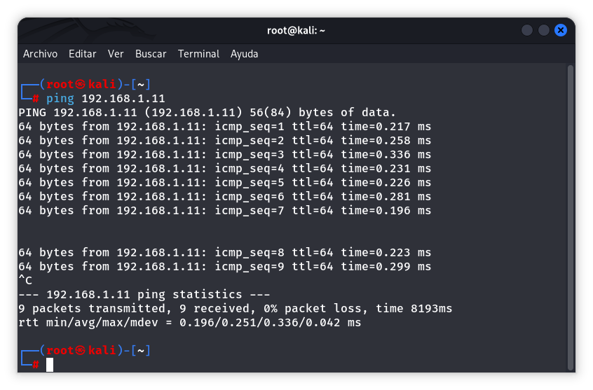
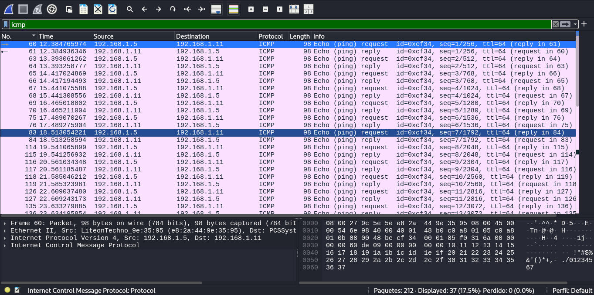
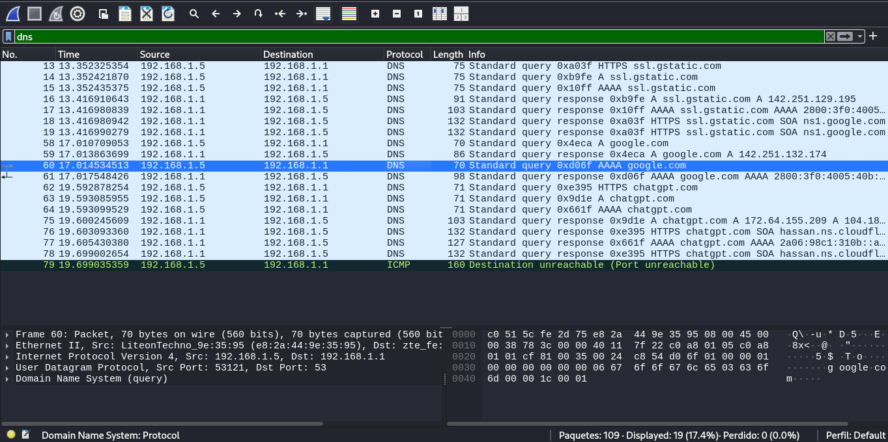
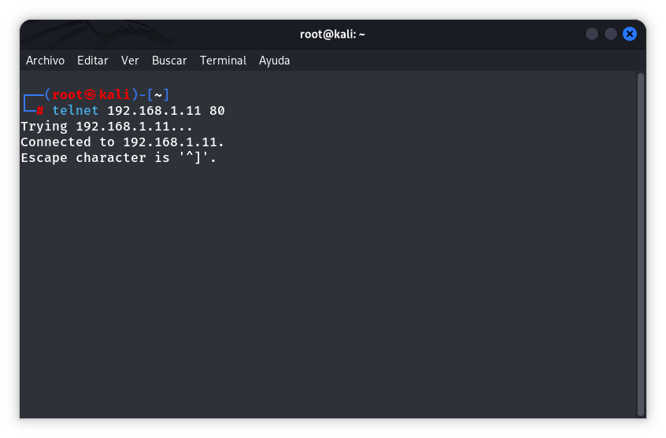
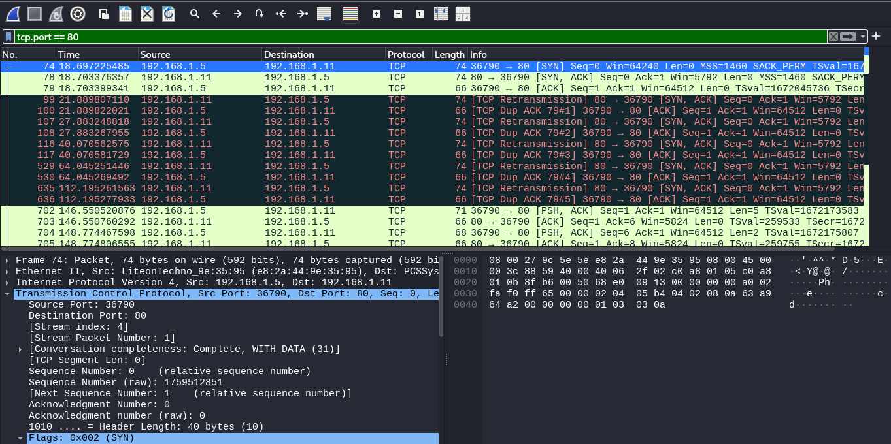
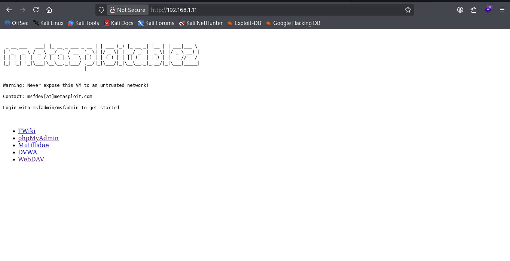
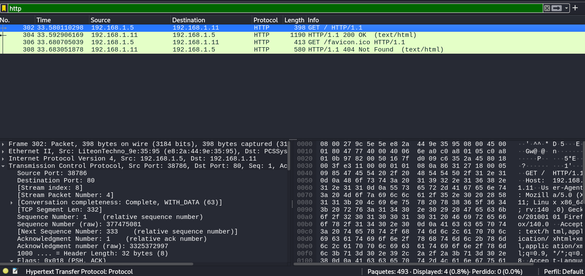

# LAB 02 - Analisis de paquetes con Wireshark

Capturar y analizar tráfico de red en un entorno controlado utilizando Wireshark, con el fin de comprender el funcionamiento de protocolos fundamentales como ICMP, DNS, TCP y HTTP.

 Capturar y analizar:
- ICMP
- DNS
- TCP Three-Way Handshake
- HTTP

## Entorno del laboratorio
Herramientas utilizadas: 
- Kali Linux
- Wireshark
- Metasploitable

Configuracion.

| Componente             | Descripción     |
| ---------------------- | --------------- |
| Máquina de análisis    | Kali Linux      |
| Máquina objetivo       | Metasploitable2 |
| Dirección IP objetivo  | 192.168.1.11    | <---- IP Objetivo
| Herramienta de captura | Wireshark       |


-----------------------------------------------------------------------------
## 1. Analisis de ICMP
Verificamos conectividad entre maquinas enviando mensajes de ICMP

Comando utilizado:
```bash
ping 192.168.1.11
```


Filtro aplicado `icmp`



### Análisis

Se observó el intercambio de mensajes ICMP entre la máquina Kali Linux `192.168.1.5` y la máquina Metasploitable2 `192.168.1.11`.

La captura muestra paquetes Echo Request enviados por el cliente y sus correspondientes Echo Reply generados por el servidor.

Este comportamiento confirma la disponibilidad del host objetivo y demuestra el funcionamiento del protocolo ICMP como mecanismo de diagnóstico y verificación de conectividad en redes IP.


### Hallazgo

> La maquina objetivo respondio exitosamente a las solicitudes ICMP, indicando conectividad activa dentro del entorno de laboratorio.

-----------------------------------------------------------------------------
## 2. Analisis DNS
Observar el proceso de resolución de nombres de dominio mediante consultas DNS.

Comando utilizado:
```bash
nslookup google.com
```

Filtro aplicado `dns`:



### Análisis

Durante la captura se observaron consultas DNS realizadas por Kali Linux hacia el servidor DNS configurado en la red.

Las peticiones incluyeron consultas para los dominios:

- google.com
- chatgpt.com

Asimismo, se identificaron consultas de tipo A y AAAA utilizadas para resolver direcciones IPv4 e IPv6 respectivamente.

Las respuestas DNS permitieron asociar los nombres de dominio con sus correspondientes direcciones IP, evidenciando el funcionamiento normal del proceso de resolución de nombres.

### Hallazgo

> Se verificó correctamente el flujo de consulta y respuesta DNS, demostrando cómo los nombres de dominio son traducidos a direcciones IP antes de establecer conexiones de red.

-----------------------------------------------------------------------------
## 3. Analisis TCP 
Analizar el proceso de establecimiento de una conexion TCP.

Comando utilizado:
```bash
telnet 192.168.1.10 80
```
Conexion al puerto HTTP del host objetivo



Filtro aplicado `tcp.port = 80`



### Análisis

Se observó el establecimiento de una conexión TCP hacia el servicio HTTP del host objetivo.

La captura muestra claramente el proceso conocido como Three-Way Handshake:

1. El cliente envía un paquete SYN.
2. El servidor responde con SYN-ACK.
3. El cliente responde con ACK.

Este mecanismo garantiza la sincronización de números de secuencia y confirma que ambas partes están preparadas para intercambiar datos de forma confiable.


### Hallazgo

> La conexión TCP fue establecida exitosamente mediante el procedimiento estándar de Three-Way Handshake, confirmando la disponibilidad del servicio HTTP en el puerto 80.

-----------------------------------------------------------------------------
## 4. Analisis HTTP
Analizar una solicitud HTTP hacia el servidor web de la máquina objetivo.

- Accedemos al sitio web alojado en la maquina Metasploitable2.



Filtro aplicado `http`



### Análisis

Se capturó tráfico HTTP generado al acceder al servidor web de la máquina Metasploitable2.

La captura evidencia una solicitud:

`GET / HTTP/1.1`

enviada desde Kali Linux `192.168.1.5` hacia el servidor web `192.168.1.11`.

Posteriormente, el servidor respondió con:

`HTTP/1.1 200 OK`

indicando que la solicitud fue procesada correctamente y que el recurso solicitado fue entregado al cliente.

También se observó una solicitud adicional para el recurso favicon.ico, la cual recibió una respuesta HTTP 404 Not Found debido a que dicho archivo no se encontraba disponible en el servidor.

### Hallazgo

La captura permitió observar el intercambio completo de mensajes HTTP entre cliente y servidor.

Debido a que HTTP transmite la información sin cifrado, fue posible visualizar el método utilizado, las cabeceras de la solicitud y las respuestas generadas por el servidor.

Este comportamiento evidencia la importancia de utilizar HTTPS para proteger la confidencialidad e integridad de la información transmitida.

### Consideración de Seguridad

El protocolo HTTP transmite la información en texto plano, permitiendo que cualquier dispositivo con acceso al tráfico de red pueda inspeccionar las solicitudes y respuestas intercambiadas.

En entornos productivos se recomienda el uso de HTTPS para proteger la información mediante cifrado TLS.

------------------------------------------------------------------------------
## Protocolos Analizados Comparacion
| Protocolo | Función Principal                        |
| --------- | ---------------------------------------- |
| ICMP      | Verificación de conectividad             |
| DNS       | Resolución de nombres de dominio         |
| TCP       | Establecimiento de conexiones confiables |
| HTTP      | Transferencia de contenido web           |

## Hallazgos Relevantes
| Hallazgo                    | Impacto                                           |
| --------------------------- | ------------------------------------------------- |
| Respuestas ICMP habilitadas | Permiten identificar hosts activos                |
| Consultas DNS visibles      | Posible análisis de actividad de usuarios         |
| Handshake TCP observable    | Permite estudiar el establecimiento de conexiones |
| HTTP sin cifrado            | Riesgo de exposición de información               |

------------------------------------------------------------------------------------------
## Conclusiones

Durante el laboratorio se analizaron diferentes protocolos fundamentales para las comunicaciones en redes IP.

Mediante Wireshark fue posible observar:

- Solicitudes y respuestas ICMP.
- Consultas y respuestas DNS.
- El proceso de establecimiento de conexiones TCP mediante Three-Way Handshake.
- Intercambios HTTP entre cliente y servidor.

La práctica permitió comprender el funcionamiento interno de estos protocolos y reforzar habilidades relacionadas con el análisis de tráfico de red, actividad fundamental para labores de monitoreo, análisis forense y respuesta a incidentes de seguridad. 
